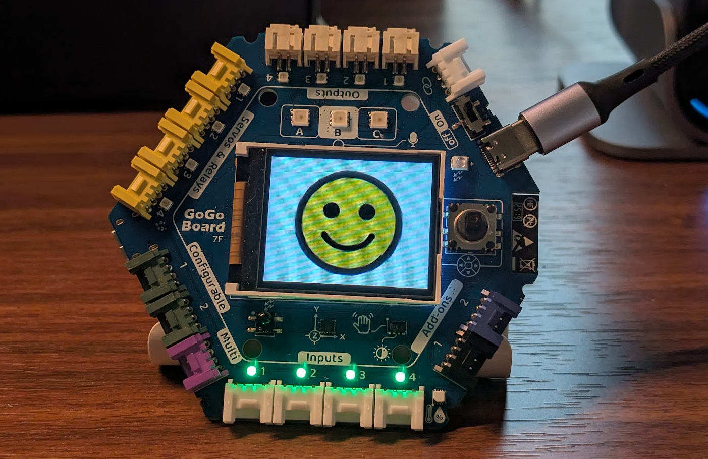
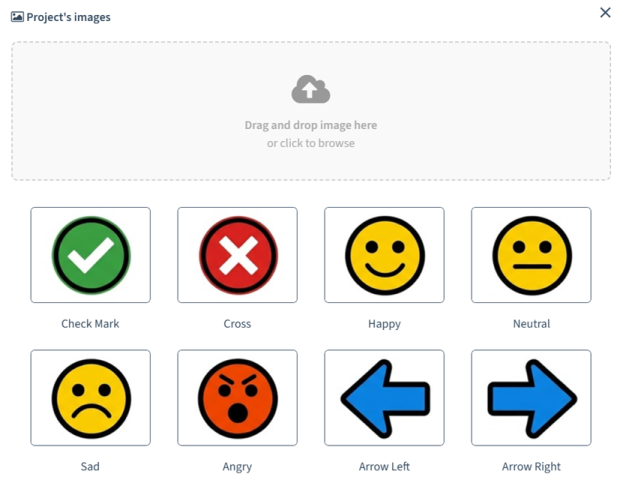
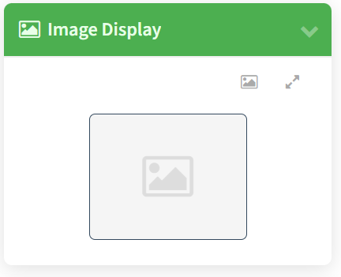
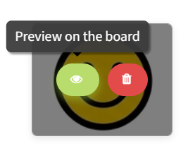
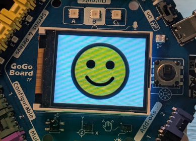
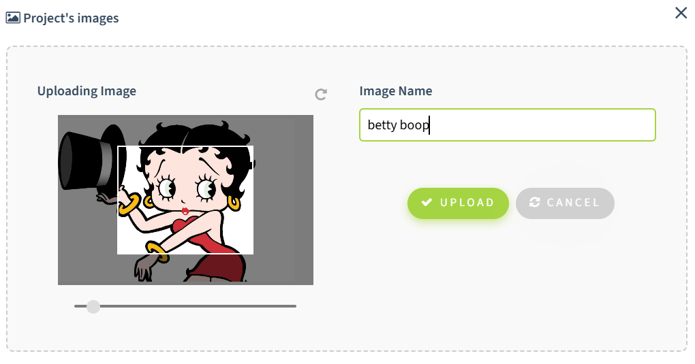
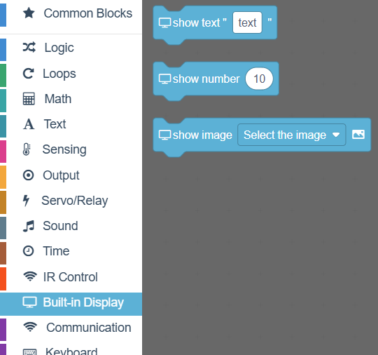
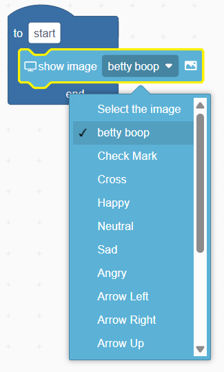
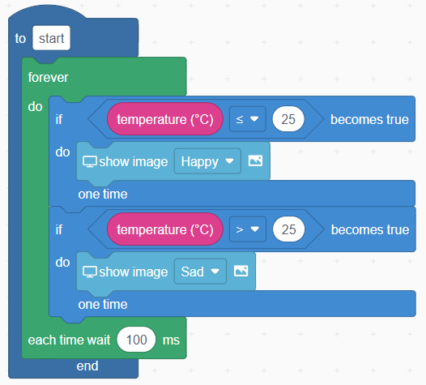

# Image Display

Show images on your GoGo Board's screen -- use photos, drawings, icons, or anything you like! Upload your own images or choose from a built-in gallery, then display them through the web app or code.

> Requires **firmware v3.2.4** or newer and a **Wi-Fi connection**.

---

## Table of Contents
- [Overview](#overview)
- [Getting Started](#getting-started)
  - [Prerequisites](#prerequisites)
  - [Using the Image Gallery](#using-the-image-gallery)
- [Using Image Display in Code](#using-image-display-in-code)
- [Tips, Specs, and Limitations](#tips-specs-and-limitations)

---

## Overview

Image Display lets you show images on the GoGo Board's LCD screen. You can use it to display backgrounds, icons, game graphics, maps, or any image relevant to your project.

There are two ways to display images:

- **From the web app** -- Upload or select an image and click the show icon to preview it directly on the board.
- **From code** -- Use the `show image` command to display a named image as part of your program.

   

---

## Getting Started

### Prerequisites

- GoGo Board with firmware **v3.2.4** or newer. See the [Firmware Update Guide](../firmware-update/firmware-update-guide.md) if you need to update.
- The GoGo Board must be **connected to Wi-Fi**. The board downloads images from the internet before displaying them.

### Using the Image Gallery

1. Open the GoGo Board web app at [code.gogoboard.org](https://code.gogoboard.org).

2. Find the **Image Display** card on the left panel. You may need to scroll down to find it.

   

3. Click on the "Project Images" icon, in the upper right corner of the card.

4. You will see the image gallery. A few images are preloaded and ready.

5. Hover your mouse over one of the preloaded images. Two buttons will appear.

6. Click the green eye icon to show that image on the GoGo Board's screen.

> - This is useful for quick testing before writing code.
> - Make sure the GoGo Board is connected to Wi-Fi.  
> - There could be a delay the first time you load an image, depending on the speed of your Wi-Fi. But the GoGo Board stores images locally, making it much faster when loading the same image later. 

7. If you want to upload your own image, drag an image into the upload area at the top of the gallery. You can resize, crop, and rotate the image to make it best fit the LCD screen. Give your image a name and save it.

---

## Using Image Display in Code

Use the `show image` command to display a named image in your program. The command is located in the "Built-in Display" category.

   

The image names in the command's drop-down list will match the names in the gallery.

   

For example, you could show a sad face when the temperature is hot and a happy face when it is cool.

   

## Tips, Specs, and Limitations

- The GoGo Board must be **connected to Wi-Fi** to download and display images. Without a connection, the `show image` command will not work.
- The GoGo Board can save up to 20 images in its memory. The first time an image is loaded from the internet, it may be slow. But the next time that same image is used, the GoGo Board will load it from memory, which is much faster.
- Saved images are cleared when the GoGo Board restarts. It will need to download them from the internet again.
- When sharing your project, all images in the image gallery will be publicly accessible by anyone with that shared project.
